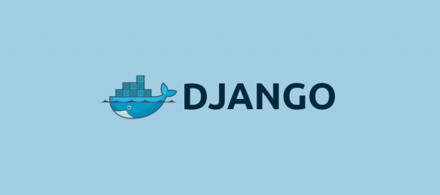
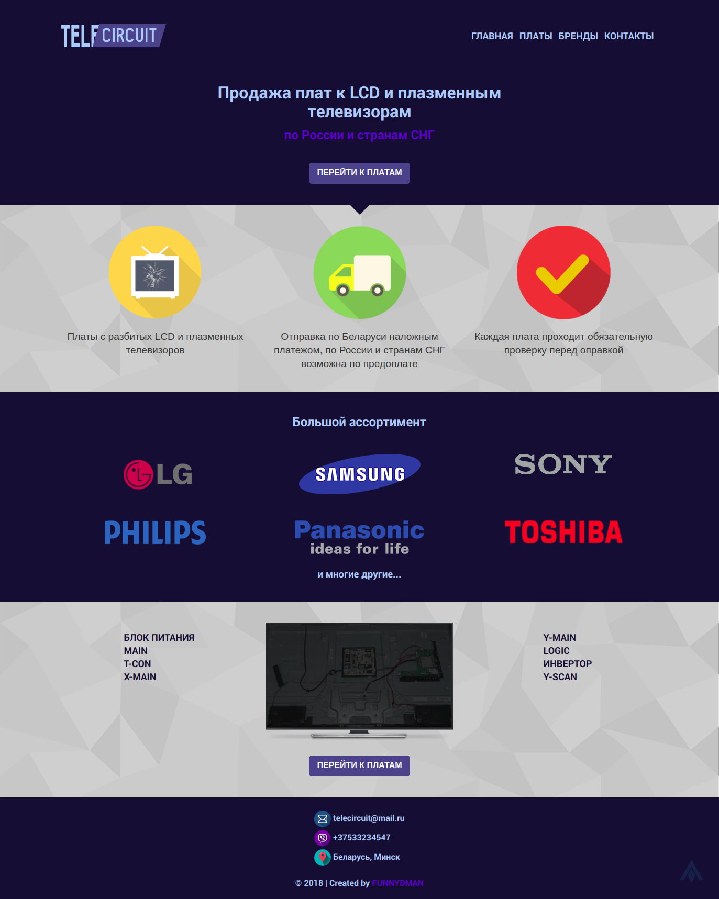
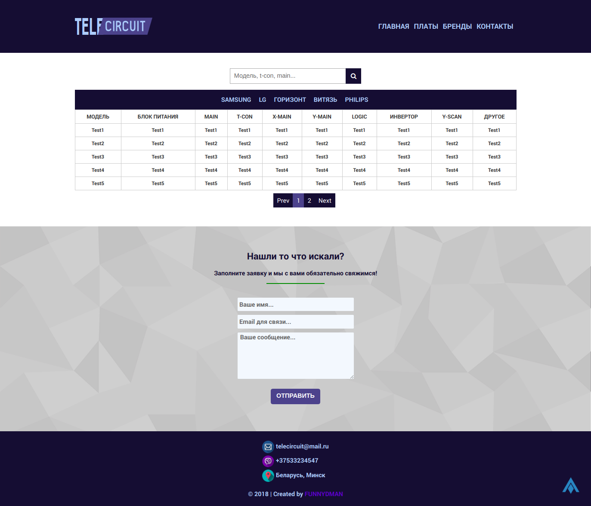

# TELECIRCUIT
is a website which provide opportunity to buy circuits and components for tvs. Telecircuit contains much brands such as Samsung, DELL, LG and etc. You can search an electronic catalog by keywords. Find what you need and after make an order. 
## Technology Stack
<p align="center"> 
  
</p>

* Docker v17.04
* Docker-compose v1.21
* Django v2.0
* Webpack v4.12


### Installing
1. Install docker and docker-compose via executing build.sh script
```bash
bash build.sh
```
2. Add user to docker group to run commands without sudo
```
sudo usermod -aG docker $USER
```
3. Go to ```/telecircuit-manager``` install dependencies for frontend and run webpack

```
npm install; npm run dev
```
4. Run docker-compose to build and run containers for the application
```
docker-compose up --build
```
5. Enter in the docker container and create django superuser
```
docker exec -it web bash
```

```
python manage.py createsuperuser
```
That's all. Now you are ready for developing. 

## Deployment

1. Please follow first two steps in *Installing* section 

2. Go to ```deployment/production``` rename file ```prod.env.sample``` to ```prod.env``` and set env variables.

3. Run docker-compose to build and run containers for the application

 ```
 docker-compose -f docker-compose.prod.yml up --build
 ```
 ## Built With
 
 * [django](https://www.djangoproject.com/) - The web framework used
 * [webpack](https://webpack.js.org/) - Static module bundler for modern JavaScript applications
 * [docker](https://www.docker.com/) - Containerization system
 
Markup was created with [template](https://github.com/agragregra/optimizedhtml-start-template)
 
## Authors

* **FUNNYDMAN** - *Initial work* 

See also the list of [contributors]() who participated in this project.

### Screenshots




Happy coding :sunglasses:
